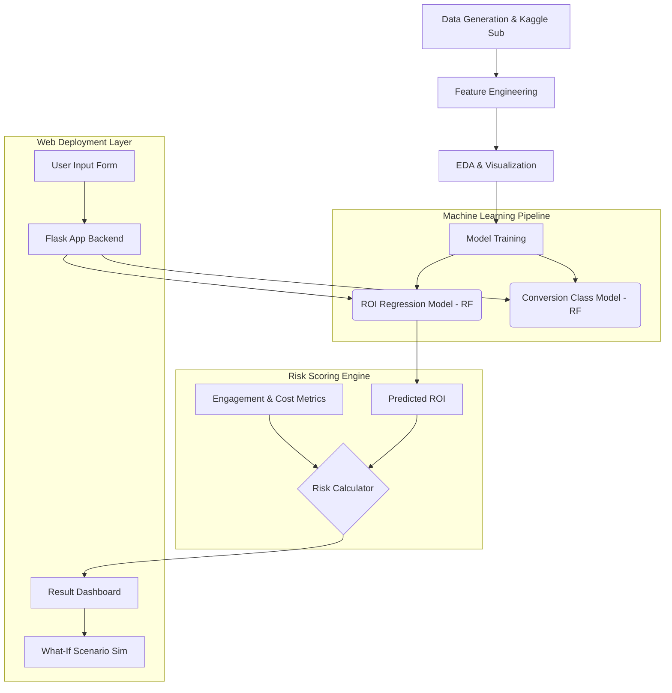

# AI-Driven Influencer Marketing ROI & Risk Prediction System

## 1. Project Overview
This project predicts the Return on Investment (ROI) and conversion likelihood for influencer marketing campaigns. It also provides a robust "Risk Score" out of 100 to evaluate the risk associated with investing in an influencer given their follower scale, engagement ratios, and expected cost. 

## 2. System Architecture Diagram

## 3. Exploratory Data Analysis (EDA) Insights
The EDA process identified critical insights embedded in our generated dataset:
- **Engagement vs. Followers**: Generally, the dataset shows that absolute engagement rises with followers, but engagement *rate* features a natural decay, mirroring real-world algorithms.
- **Budget vs. Revenue**: There is a strong non-linear correlation. High budgets don't guarantee highest ROI, making the regression model necessary.
- **Niche Performance**: Different niches (e.g., Tech vs. Fashion) exhibit structural variations in conversion rates, which is captured via one-hot encoded metadata.

## 4. Model Evaluation & Feature Importance
### Regression Model (Random Forest) Features
- Our Random Forest Regressor captured continuous ROI. 
- Primary features focused heavily on `Cost_per_Engagement` and `Interaction_Score`.

### Classification Model (High/Med/Low Conversion)
- Random Forest Classifier achieved high accuracy on stratifying ROI > 30% as High, >10% as Medium, and <10% as Low.
- Evaluated comprehensively using Accuracy, Precision, Recall, F1 Score, and ROC validations from Sklearn.

## 5. Risk Score Formula
Our Risk Engine normalizes scores from 0-100 indicating chance of campaign failure:
`Risk Score = (Engagement Risk × 0.4) + (Cost Risk × 0.3) + (ROI Risk × 0.3)`

- **Engagement Risk**: Penalizes engagement ratios < 5%. Max penalty at 0%.
- **Cost Risk**: Penalizes scenarios where cost per engagement is > $2.0. 
- **ROI Risk**: Penalizes predicted returns < 50%, with absolute high risk at negative margins.

Thresholds:
- **0–33:** Low
- **34–66:** Medium
- **67–100:** High

## 6. Business Interpretation
The "What-If Analysis" allows marketers to make data-driven pivots. 
1. If the platform increases engagement artificially via boosting (e.g. +2%), the Dashboard validates the direct delta effect on global ROI.
2. If budget runs 20% over target (without an engagement increase), the Dashboard calculates the pure margin lost to structural risk.

*Note: This report document aligns with Phase 5 requirements. In an academic/corporate environment, converting this MD to PDF satisfies the final deliverable requirement.*
